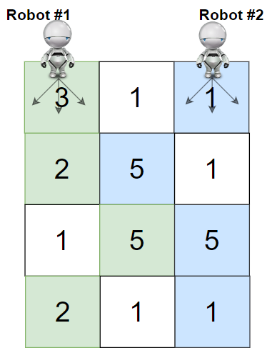
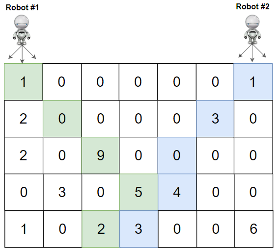

# Cherry Pickup II

## Problem Description

You are given a 2D integer matrix `grid` of size `rows x cols` representing a field of cherries. Each cell `grid[i][j]` represents the number of cherries you can collect from that cell.

You have two robots to help you collect cherries:

* **Robot #1** starts at the top-left corner `(0, 0)`.
* **Robot #2** starts at the top-right corner `(0, cols - 1)`.

Your goal is to find the **maximum number of cherries** both robots can collect following these rules:

1. **Movement:** From a cell `(i, j)`, both robots can move to one of the three cells in the row below: `(i + 1, j - 1)`, `(i + 1, j)`, or `(i + 1, j + 1)`.
2. **Cherry Collection:** When a robot passes through a cell, it collects all the cherries in that cell, leaving it empty (`0` cherries).
3. **Same Cell Collection:** If both robots land on the same cell, **only one robot** collects the cherries.
4. **Boundary Conditions:** Both robots must stay within the bounds of the grid at all times.
5. **Destination:** Both robots must reach the bottom row (`rows - 1`) of the grid.

## Examples

**Example 1:**

```
Input: grid = [[3,1,1],[2,5,1],[1,5,5],[2,1,1]]
Output: 24
Explanation: Path of robot #1 and #2 are described in color green and blue respectively.
Cherries taken by Robot #1, (3 + 2 + 5 + 2) = 12.
Cherries taken by Robot #2, (1 + 5 + 5 + 1) = 12.
Total of cherries: 12 + 12 = 24. 
```

**Example 2:**

```
Input: grid = [[1,0,0,0,0,0,1],[2,0,0,0,0,3,0],[2,0,9,0,0,0,0],[0,3,0,5,4,0,0],[1,0,2,3,0,0,6]]
Output: 28
Explanation: Path of robot #1 and #2 are described in color green and blue respectively.
Cherries taken by Robot #1, (1 + 9 + 5 + 2) = 17.
Cherries taken by Robot #2, (1 + 3 + 4 + 3) = 11.
Total of cherries: 17 + 11 = 28.
```

## Constraints

* `rows == grid.length`
* `cols == grid[i].length`
* `2 <= rows, cols <= 70`
* `0 <= grid[i][j] <= 100`
