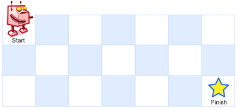

# Unique Paths

## Problem Description

Imagine a robot positioned on an `m x n` grid. The robot starts at the top-left corner (`grid[0][0]`) and its goal is to reach the bottom-right corner (`grid[m - 1][n - 1]`).

The robot has limited movement options: it can only move one step **down** or one step **right** at a time.

Your task is to write a program to determine the **number of unique paths** the robot can take to get from its starting position to the bottom-right corner.

**Guarantee:** The answer will be less than or equal to 2 * 10^9.

## Examples

### Example 1

**Input:** 
* `m` = 3, `n` = 7

**Output:** 28

### Example 2

**Input:** 
* `m` = 3, `n` = 2

**Output:** 3

**Explanation:**  There are 3 possible paths from the top-left to the bottom-right corner:
1. **Right** -> **Down** -> **Down**
2. **Down** -> **Down** -> **Right**
3. **Down** -> **Right** -> **Down**

## Constraints

* 1 <= `m`, `n` <= 100