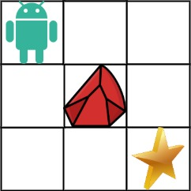
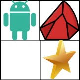

# Unique Paths II

## Problem Description

You are given an `m x n` integer array `obstacleGrid` representing a grid of squares. 

* Each cell in the grid can be either empty (represented by `0`) or blocked by an obstacle (represented by `1`).

A robot is initially located at the **top-left corner** of the grid (`grid[0][0]`). The robot can only move either **down** or **right** at any point in time. Its goal is to reach the **bottom-right corner** of the grid (`grid[m - 1][n - 1]`).

Your task is to determine the **number of possible unique paths** that the robot can take to reach the bottom-right corner, considering it cannot move through obstacles.

**Important:** The test cases are generated in a way that ensures the answer will always be less than or equal to 2 * 109.

## Examples

### Example 1

**Input:** `obstacleGrid = [[0,0,0],[0,1,0],[0,0,0]]`

**Output:** `2`

**Explanation:** The image below illustrates the grid and the two possible paths (marked in blue):

1. **Right -> Right -> Down -> Down**
2. **Down -> Down -> Right -> Right**

 

### Example 2

**Input:** `obstacleGrid = [[0,1],[0,0]]`

**Output:** `1`

**Explanation:** In this case, there's only one possible path to reach the destination.

## Constraints

* `m == obstacleGrid.length`
* `n == obstacleGrid[i].length`
* `1 <= m, n <= 100`
* `obstacleGrid[i][j]` is either `0` (empty) or `1` (obstacle).](image.png)